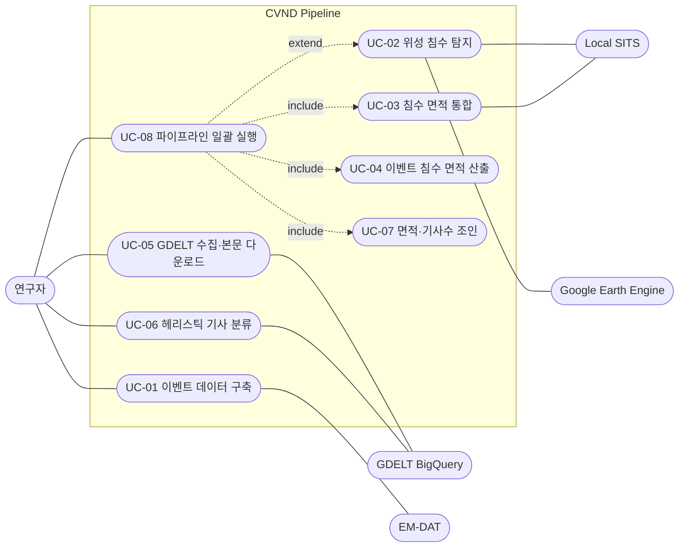

> **Historical state pipeline reference.** The current primary workflow is event × district. See [README](../README.md) for the runnable sequence and [district methodology](district_methodology.md) for observation rules.

# CVND Use Cases

CVND 파이프라인(홍수 침수 면적과 헤리스틱 기사 수 집계)의 유스케이스 정리.
상세 알고리즘은 [README](../README.md)와 각 `src/*.py` 모듈 문서를 참고.

## 액터

| 액터 | 종류 | 역할 |
| --- | --- | --- |
| 연구자 (Researcher) | 주 액터 | 파이프라인 실행, 파라미터(SKIP 플래그) 설정, 결과 해석 |
| Google Earth Engine | 외부 시스템 | Sentinel-1/2 영상 및 침수 탐지 연산 |
| 로컬 GPU/CPU | 로컬 시스템 | SITS-VAE 추론으로 패치 점수 생성 |
| GDELT BigQuery | 외부 시스템 | 다국어 기사 URL·메타데이터 제공(본문 미포함) |
| EM-DAT | 외부 데이터 | 재난 목록 |

## Use Case Diagram

## Use Case Specification

### UC-01 이벤트 데이터 구축

| 항목 | 내용 |
| --- | --- |
| 액터 | 연구자, EM-DAT |
| 목적 | EM-DAT 홍수 레코드를 parent event와 district 관측 레지스트리로 변환 |
| 사전조건 | `data/raw/EM-DAT-BASE.xlsx` |
| 주 흐름 | 홍수·연도 필터 → parent event 보존 → 명시적 district 근거 확장 |
| 결과 | `data/raw/events.csv`, `data/intermediate/event_districts.csv` |
| 구현 | `src/build_emdat_events.py` |

### UC-02 위성 침수 탐지 (선택, `SKIP_GEE=0`)

| 항목 | 내용 |
| --- | --- |
| 액터 | 연구자, Google Earth Engine, 로컬 GPU/CPU |
| 목적 | 이벤트별 침수 범위 산출, 로컬 H5 보존 및 SITS 점수 생성 |
| 사전조건 | GEE 인증, `.env`의 `GEE_PROJECT_ID` |
| 주 흐름 | Track A(S1/S2 Otsu) → `flood_extent.csv`; Track B → 로컬 H5 영구 저장 → 로컬 추론 → `sits_scores/` |
| 예외 | 구름 과다 시 광학 대신 레이더(S1) 경로 사용 |
| 구현 | `src/satellite.py`, `src/run_sits_inference.py` |

### UC-03 침수 면적 통합

| 항목 | 내용 |
| --- | --- |
| 액터 | 연구자 |
| 목적 | SITS·NDWI·S1 결과를 이벤트별 단일 침수 면적으로 결합 |
| 사전조건 | `flood_extent.csv` + `sits_scores/` |
| 주 흐름 | 품질 게이트(Youden J) → 융합/전구역 NDWI 선택 → 구름 라우팅(≥60%면 S1) |
| 결과 | `data/intermediate/district_flood_combined.csv` |
| 구현 | `src/merge_results.py` |

### UC-04 district 침수 면적 산출

| 항목 | 내용 |
| --- | --- |
| 액터 | 연구자 |
| 목적 | district별 통합 침수 면적과 AOI 비율을 검증해 표로 정리 |
| 사전조건 | `district_flood_combined.csv`, `event_districts.csv`, `district_aoi.csv` |
| 주 흐름 | district identity·AOI provenance 검증 → 결측/관측 0 보존 |
| 결과 | `data/intermediate/district_flood_area.csv` |
| 구현 | `src/build_flood_area_table.py` |

### UC-05 GDELT 수집·본문 다운로드 (선택)

| 항목 | 내용 |
| --- | --- |
| 액터 | 연구자, GDELT BigQuery |
| 목적 | 이벤트 창에 맞는 GDELT URL 메타데이터와 원문 본문 확보 |
| 사전조건 | 공식 `event_districts.csv`, Google ADC(실행 시) |
| 주 흐름 | district 14일 BigQuery SQL 생성/실행 → district metadata → `download_articles.py` |
| 결과 | `data/intermediate/district_gdelt.articles.jsonl.gz`, district article database |
| 구현 | `src/district_articles.py`, `src/download_articles.py` |

### UC-06 district 헤리스틱 기사 집계

| 항목 | 내용 |
| --- | --- |
| 액터 | 연구자 |
| 목적 | 다운로드 본문에서 홍수 키워드 매칭으로 event-district별 기사 수 산출 |
| 사전조건 | district article database, district manifest, `event_districts.csv` |
| 주 흐름 | district 근거·창구·본문 상태 검증 → district heuristic count |
| 결과 | `data/results/district_article_counts.heuristic.csv` |
| 구현 | `src/district_articles.py` |

### UC-07 district 면적·기사수 조인

| 항목 | 내용 |
| --- | --- |
| 액터 | 연구자 |
| 목적 | event-district별 침수 면적, 기사 수, Census 공변량을 결합 |
| 사전조건 | `district_flood_area.csv`, district counts, `district_covariates.csv` |
| 주 흐름 | district identity 1:1 검증 → Census many:1 결합 → 제외 사유 기록 |
| 결과 | `data/results/district_flood_articles.csv`, `district_analysis_exclusions.csv` |
| 구현 | `src/join_district_flood_articles.py` |

### UC-08 파이프라인 일괄 실행

| 항목 | 내용 |
| --- | --- |
| 액터 | 연구자 |
| 목적 | 캐시된 district 산출물 기반으로 분석까지 한 번에 재현 |
| 사전조건 | `venv/`, district 캐시와 district counts |
| 주 흐름 | UC-01 → UC-02 → UC-03 → UC-04 → UC-05 → UC-06 → UC-07 → 분석 |
| 확장 | `SKIP_GEE=0`이면 UC-02 포함, `SKIP_ARTICLES=0`이면 GDELT 재수집 |
| 구현 | `scripts/run_pipeline.sh` |
