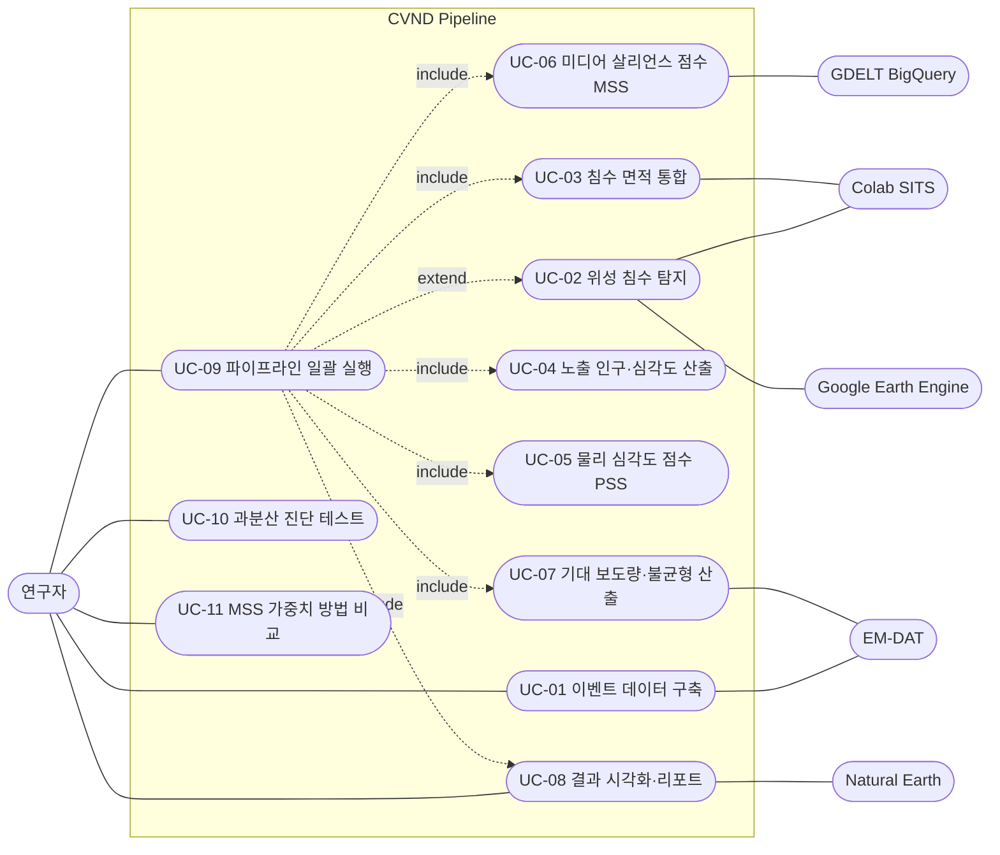

# CVND Use Cases

CVND 파이프라인(홍수 피해 대비 언론 보도 불균형 측정)의 유스케이스 정리.
상세 알고리즘은 [README](../README.md)와 각 `src/*.py` 모듈 문서를 참고.

## 액터

| 액터 | 종류 | 역할 |
| --- | --- | --- |
| 연구자 (Researcher) | 주 액터 | 파이프라인 실행, 파라미터(SKIP 플래그) 설정, 결과 해석 |
| Google Earth Engine | 외부 시스템 | Sentinel-1/2 영상 및 침수 탐지 연산 |
| Colab (SITS inference) | 외부 시스템 | SITS-VAE 추론으로 패치 점수 생성 |
| GDELT BigQuery | 외부 시스템 | 다국어 기사 집계 결과(JSON) 제공 |
| EM-DAT | 외부 데이터 | 재난 목록 및 사망자 수 |
| Natural Earth | 외부 데이터 | 주 경계 지도(choropleth) |

## Use Case Diagram

## Use Case Specification

### UC-01 이벤트 데이터 구축 (선택/레거시)

| 항목 | 내용 |
| --- | --- |
| 액터 | 연구자, EM-DAT |
| 목적 | EM-DAT 홍수 레코드를 주·지구 단위 분석 이벤트로 변환 |
| 사전조건 | `data/raw/EM-DAT-BASE.xlsx`, `data/raw/events.csv` 존재 |
| 주 흐름 | 홍수·연도 필터 → 주 단위 분해 → 지구/bbox 할당 → 이벤트 ID 부여 |
| 결과 | `data/raw/events.csv` |
| 구현 | `src/archive/build_events_emdat.py` (현재 캐시된 events 사용) |

### UC-02 위성 침수 탐지 (선택, `SKIP_GEE=0`)

| 항목 | 내용 |
| --- | --- |
| 액터 | 연구자, Google Earth Engine, Colab |
| 목적 | 이벤트별 침수 범위 산출 및 SITS 학습용 패치 생성 |
| 사전조건 | GEE 인증, `.env`의 `GEE_PROJECT_ID` |
| 주 흐름 | Track A(S1/S2 Otsu) → `data/cache/flood_extent.csv`; Track B(state AOI 패치) → Colab 추론 → `data/cache/sits_scores/` |
| 예외 | 구름 과다 시 광학 대신 레이더(S1) 경로 사용 |
| 구현 | `src/satellite.py` |

### UC-03 침수 면적 통합

| 항목 | 내용 |
| --- | --- |
| 액터 | 연구자 |
| 목적 | SITS·NDWI·S1 결과를 이벤트별 단일 침수 면적으로 결합 |
| 사전조건 | `flood_extent.csv` + `sits_scores/` |
| 주 흐름 | 품질 게이트(Youden J) → 융합/전구역 NDWI 선택 → 구름 라우팅(≥60%면 S1) |
| 결과 | `data/flood_combined.csv` |
| 구현 | `src/merge_results.py` |

### UC-04 노출 인구·심각도 산출

| 항목 | 내용 |
| --- | --- |
| 액터 | 연구자 |
| 목적 | 침수 면적을 주 인구밀도와 결합해 노출 인구 추정 |
| 사전조건 | `flood_combined.csv`, `events.csv`, `population.csv` |
| 주 흐름 | 주 이름 정규화 → 면적/노출률 계산 → 인구 노출 추정 |
| 결과 | `data/severity_raw.csv` |
| 구현 | `src/compute_population.py` |

### UC-05 물리 심각도 점수 (PSS)

| 항목 | 내용 |
| --- | --- |
| 액터 | 연구자 |
| 목적 | 면적·노출 인구를 하나의 심각도 점수로 합성 |
| 주 흐름 | `log1p` 변환 → MinMax 정규화 → 0.5/0.5 가중 합 → 가중치 민감도 점검 |
| 결과 | `data/pss_results.csv` |
| 구현 | `src/compute_pss.py` |

### UC-06 미디어 살리언스 점수 (MSS)

| 항목 | 내용 |
| --- | --- |
| 액터 | 연구자, GDELT BigQuery |
| 목적 | 기사량·점유율·최초보도 지연·보도 지속일을 합성 |
| 사전조건 | `data/gdelt_bq.json` |
| 주 흐름 | 파트 병합 → 이벤트 집계 → 성분 정규화 → AHP 가중(Entropy는 민감도) |
| 결과 | `data/mss_results.csv`, 가중치 메타/출처 파일 |
| 구현 | `src/compute_mss.py` |

### UC-07 기대 보도량·불균형 산출

| 항목 | 내용 |
| --- | --- |
| 액터 | 연구자, EM-DAT |
| 목적 | 피해 규모로 기대 보도량을 추정하고 실제 보도량과의 격차 계산 |
| 사전조건 | `severity_raw`, `pss_results`, `mss_results`, `EM-DAT-BASE.xlsx` |
| 주 흐름 | 분석 프레임 구성 → 사망자 매칭 → 심각도 대리변수 AIC 선택 → 음이항(NegBin) 적합 → `log_ratio` 산출 |
| 결과 | `data/expected_coverage.csv`, `state_expected_coverage.csv`, `outputs/pipeline_result.md` |
| 판정 | `log_ratio < 0` 과소보도 / `> 0` 과다보도 |
| 구현 | `src/compute_expected_coverage.py` |

### UC-08 결과 시각화·리포트

| 항목 | 내용 |
| --- | --- |
| 액터 | 연구자, Natural Earth |
| 목적 | 그림·표로 결과 제시 및 리포트 그림 링크 갱신 |
| 사전조건 | `pss_results`, `mss_results`, `expected_coverage` |
| 주 흐름 | plot1(PSS–MSS), plot5–8(보정·잔차·랭킹·소득), plot9(주별 지도) 생성 → 리포트 Figures 섹션 갱신 |
| 결과 | `outputs/plot{1,5..9}_*.png/.csv`, `outputs/pipeline_result.md` |
| 구현 | `src/visualize.py` |

### UC-09 파이프라인 일괄 실행

| 항목 | 내용 |
| --- | --- |
| 액터 | 연구자 |
| 목적 | 캐시된 산출물 기반으로 전체 분석을 한 번에 재현 |
| 사전조건 | `venv/`, 캐시 데이터(`flood_combined`, `gdelt_bq.json`) |
| 주 흐름 | UC-03 → UC-04 → UC-05 → UC-06 → UC-07 → UC-08 순차 실행 |
| 확장 | `SKIP_GEE=0`이면 UC-02 포함, `SETUP_DEPS=1`이면 의존성 재설치 |
| 구현 | `scripts/run_pipeline.sh` |

### UC-10 과분산 진단 테스트 (독립)

| 항목 | 내용 |
| --- | --- |
| 액터 | 연구자 |
| 목적 | 기사 수에 음이항을 쓴 근거를 과분산 기준으로 검증 |
| 주 흐름 | Poisson·NegBin·OLS 동일 설계 적합 → Pearson 분산비·AIC·LR 비교 |
| 결과 | `test/outputs/overdispersion_report.md` 외 |
| 구현 | `test/test_negbin_overdispersion.py` |

### UC-11 MSS 가중치 방법 비교 (독립)

| 항목 | 내용 |
| --- | --- |
| 액터 | 연구자 |
| 목적 | AHP·PCA·EWM·Equal 가중치의 점수/순위 차이 확인 |
| 주 흐름 | 성분 로드 → 4개 가중치 산출 → 상관·순위 이동 비교 |
| 결과 | `test/outputs/mss_weight_report.md` 외 |
| 구현 | `test/test_mss_weight_methods.py` |
